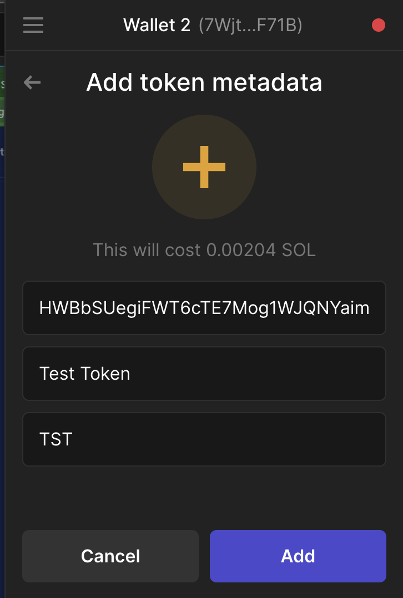
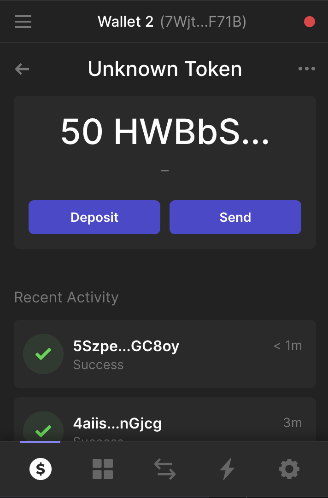

# Install

`cargo install spl-token-cli`

# Wallet

Create new - `solana-keygen new`

Get SOL - `solana airdrop 1 GvRudibnYQuHUJkrSDiqMtiGPL8sxscYJ9ob9AbP7z83 --url https://api.devnet.solana.com`

Check Balance - `solana balance --url https://api.devnet.solana.com`

# Create Token

Create on devnet - `spl-token create-token --url https://api.devnet.solana.com`

```
Creating token HWBbSUegiFWT6cTE7Mog1WJQNYaimHGUDnAPUUwc4Bs5

Signature: 5nABaEkZ3DXrBFohidRA1vQpR1VhdDMsYFJSSpy89PbM7D82Hys8Cpjy5uGrFv8ygLqDZEzHo9NyPw7RZEipGkba
```

Create token account - `spl-token create-account HWBbSUegiFWT6cTE7Mog1WJQNYaimHGUDnAPUUwc4Bs5 --url https://api.devnet.solana.com`

```
Creating account Cc8SPNobF7RHjWixCbkhQGpxy8JpU2SQUFPchvNQzsLX

Signature: 5CS9BgTSGjae1LBbTUft2MU4PNLQhF7bcNbrATsEqDqSZ7uk2m7q1C1XS2xcn8rRibTzq4f67KChYdgaNdRhj4gv
```

Check Token Balance - `spl-token balance HWBbSUegiFWT6cTE7Mog1WJQNYaimHGUDnAPUUwc4Bs5 --url https://api.devnet.solana.com`

```
0
```

# Mint new tokens

Mint new token into account - `spl-token mint HWBbSUegiFWT6cTE7Mog1WJQNYaimHGUDnAPUUwc4Bs5 100 --url https://api.devnet.solana.com`

```
Minting 100 tokens
  Token: HWBbSUegiFWT6cTE7Mog1WJQNYaimHGUDnAPUUwc4Bs5
  Recipient: Cc8SPNobF7RHjWixCbkhQGpxy8JpU2SQUFPchvNQzsLX

Signature: 5g1cHGeWJVjhYjtSFcSMoxUfLkzfBCWpZw37CgDkQoXSTC3P6msTPRyDMUUFtHaxks8gCMJerJNBk5rDx4U4g13j
```

# Token Actions

Check total token suppy - `spl-token supply HWBbSUegiFWT6cTE7Mog1WJQNYaimHGUDnAPUUwc4Bs5 --url https://api.devnet.solana.com`

```
100
```

Disable minting - `spl-token authorize HWBbSUegiFWT6cTE7Mog1WJQNYaimHGUDnAPUUwc4Bs5 mint --disable --url https://api.devnet.solana.com`

```
  Current mint authority: FHpfA79c6LFA9wbRw8PLxD1kuGhyec61NSJLSKvyQvDz
  New mint authority: disabled

Signature: 3hVvM4KHSuTTmBW2BcahNcjReDkwjBnHRsnFxLhFC96f8uFKX4Xzy6TRp6ZG4wRQLyAg1RcuYXfKmpVBTfD7DFHw
```

Burn tokens - `spl-token burn Cc8SPNobF7RHjWixCbkhQGpxy8JpU2SQUFPchvNQzsLX 10 --url https://api.devnet.solana.com`

```
Burn 10 tokens
  Source: Cc8SPNobF7RHjWixCbkhQGpxy8JpU2SQUFPchvNQzsLX

Signature: 2RZ9XVTdVy98UyWZcSY7jA2La1ywhqtPeGX7cDdbKNAckD7kAF8pgVD6DFDZZazDr3yEgVUdokYnLyfrcu1m6QHh
```

Transfer - `spl-token transfer HWBbSUegiFWT6cTE7Mog1WJQNYaimHGUDnAPUUwc4Bs5 50 7WjtBjDihb9conPYKH94FXB5a9UxiJsZroC25cLF71B --url https://api.devnet.solana.com`

```
Transfer 50 tokens
  Sender: Cc8SPNobF7RHjWixCbkhQGpxy8JpU2SQUFPchvNQzsLX
  Recipient: 7WjtBjDihb9conPYKH94FXB5a9UxiJsZroC25cLF71B
  Recipient associated token account: 651DmGS2uo9xMPS1SztTsbRzeHnfDFpQqM8ibzrTwdx8

Signature: 5SzpeLcBh3LBMRGTCqNT9E5Sp2PzPAx7BbENKKSfw4HjYsQWXd5XRvd89dsPSJYJDpJxBfwj2FX6NXkGXt9GC8oy
```





Add Token to repo [PR](https://github.com/solana-labs/token-list/pull/18395) -

```
{
  "chainId": 101,
  "address": "HWBbSUegiFWT6cTE7Mog1WJQNYaimHGUDnAPUUwc4Bs5",
  "symbol": "YUSH",
  "name": "Yush Token",
  "decimals": 8,
  "logoURI": "https://global-uploads.webflow.com/5e157547d6f791d34ea4e2bf/6087f2b060c7a92408bac811_logo.svg",
  "tags": [
      "test"
  ],
  "extensions": {}
}
```
