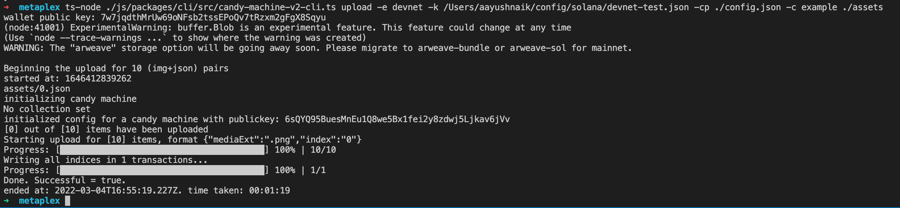
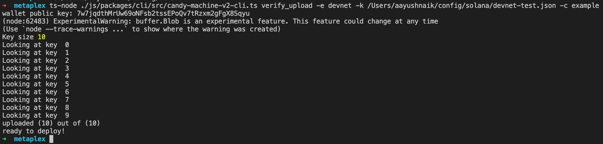
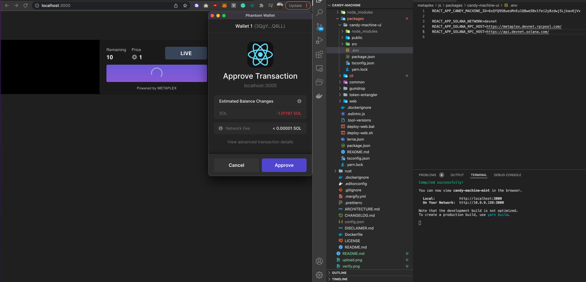
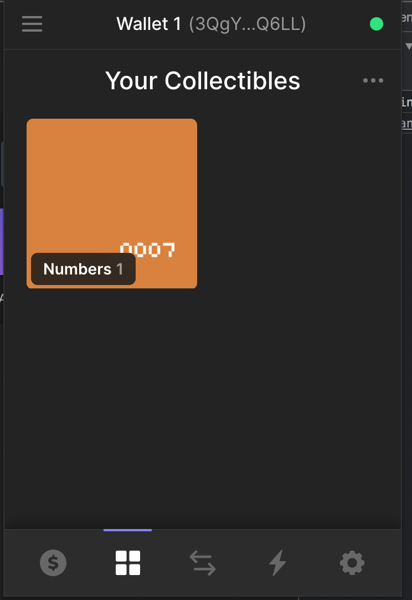

# Candy Machine

## Upload

`ts-node ./js/packages/cli/src/candy-machine-v2-cli.ts upload -e devnet -k /Users/aayushnaik/config/solana/devnet-test.json -cp ./config.json -c example ./assets`

Public Key - `6sQYQ95BuesMnEu1Q8we5Bx1fei2y8zdwj5Ljkav6jVv`

## Verify

`ts-node ./js/packages/cli/src/candy-machine-v2-cli.ts verify_upload -e devnet -k /Users/aayushnaik/config/solana/devnet-test.json -c example`

## Mint

## Wallet Collection

