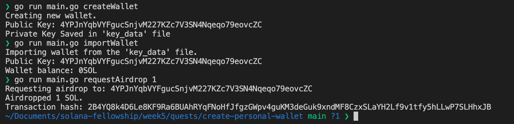
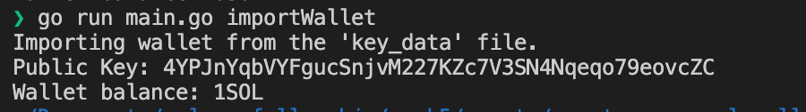
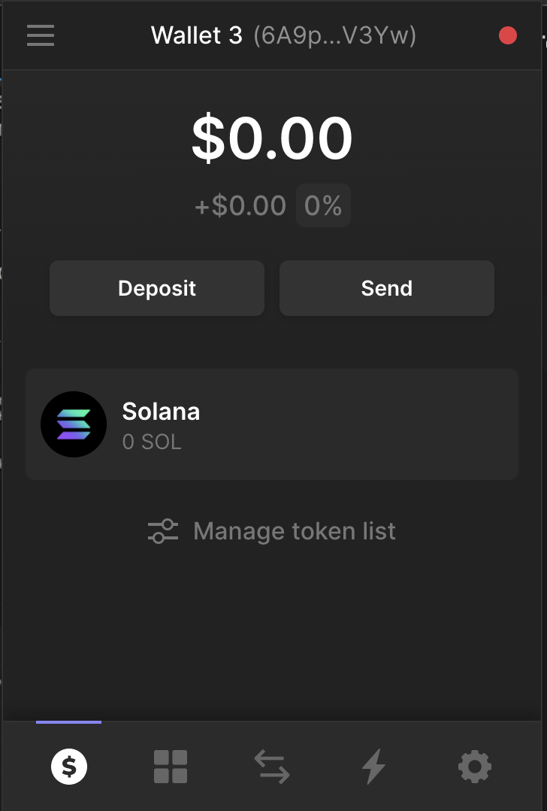
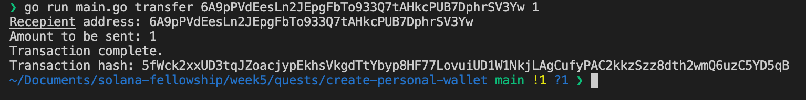
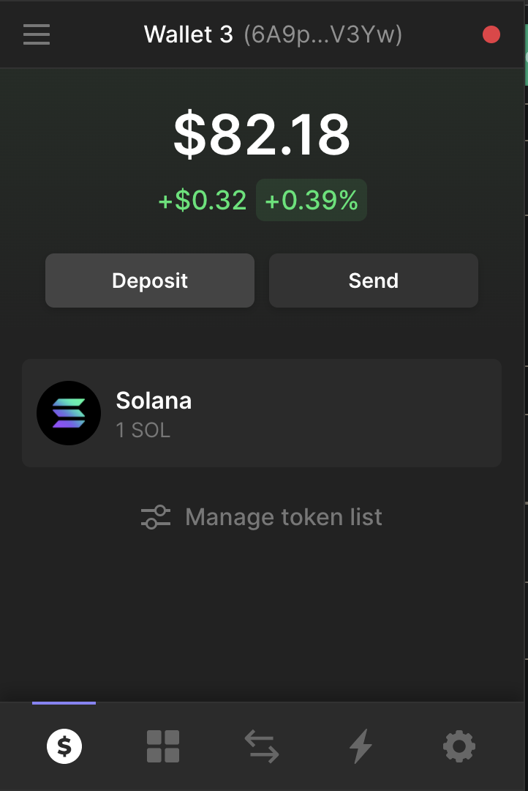

# Create Personal Wallet

## Environment Setup

Install CLI - `go install github.com/spf13/cobra-cli@latest`

Init Go Module - `go mod init create-personal-wallet`

Init Cobra Module - `cobra-cli init create-personal-wallet`

Move the `go.mod` file into the newly created folder

Install Solana SDK - `go get -u github.com/portto/solana-go-sdk@v1.8.1`

Run - `go run main.go`

Should work without any issues.

# Run CLI

- Create, Import and request Airdrop.

  

- Check Balance

  

- Transfer Recepient Before

  

- Transfer Execute

  

- Transfer After

  
